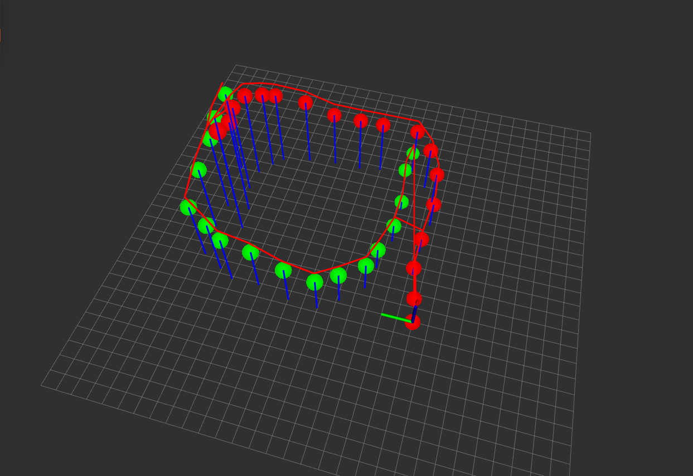
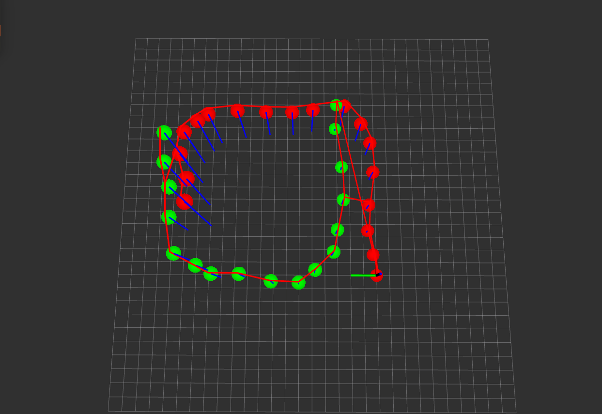
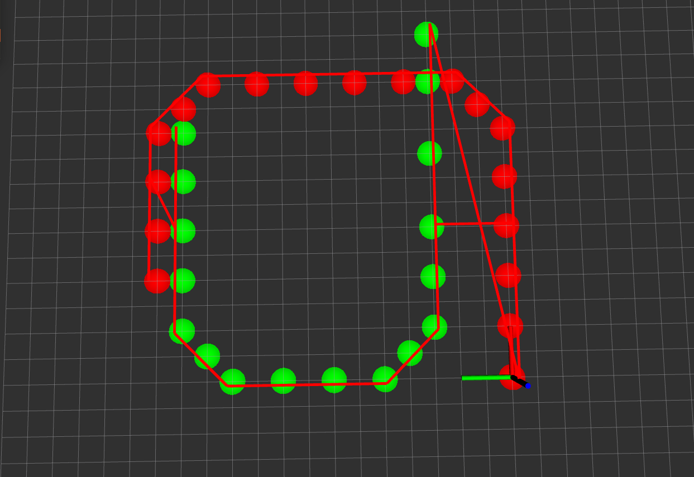

# *Cooperative SLAM*
***
## 1.Env
    Ubuntu 18.04

## 2.Dependency
    ros-kinetic
    g2o
    pcl 1.7
    eigen3 3.3
    sophus 
    glog
    hdl_graph_slam

## 3.Usage
    多机器人协同建图与定位

## 4.Note

#### date    20211108
    #version v0.6
    #status  仿真
    #brief   1. 测试基于图优化的多机器人协同建图方法。
             2. 测试数据为手工拟定的两个机器人的里程计数据，记录在src/多个test文件中。
             3. 图中主要有位姿节点、位姿间的边、平面节点、位姿与平面的边。
             4. 优化效果依赖观测值的精度，即边的测量值的好坏。
             5. 两次机器人相遇都为图中添加了回环的边。
             6. 新增了位姿节点与平面的约束。
## 5.Usage
```asm
mkdir worckspace
cd workspace
mkdir src
cd src
git clone https://github.com/Rendoudou/cslam.git
cd ..
catkin_make -j4
```

## 6.Simulation


